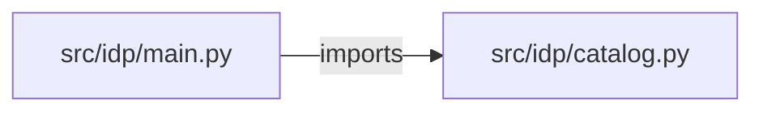

# self-service-developer-platform — project architecture

[README](README.md) · [Interview questions and answers](INTERVIEW_QA.md)

## Purpose and scope

A developer picks a template, names a service, and asks for an environment. The API runs every check the template needs, lists the files the scaffold would create, and records the request. A second person approves it. Nothing is applied: approval produces the next step, a pull request to the GitOps repository, and Argo CD stays the only writer to the cluster.

This document describes files and symbols in this checkout. Deployment templates and statements in the original overview are distinguished from a verified running environment.

## Component diagram



For Python repositories, arrows show resolved local imports, not network calls or deployment order. Otherwise the diagram is a repository component map; containment arrows do not assert runtime integration.

## Components and responsibilities

| Component | Responsibility |
| --- | --- |
| [`src/idp/main.py`](src/idp/main.py) | HTTP handlers: `GET /healthz`, `GET /catalog/templates`, `POST /catalog/requests`, `GET /catalog/requests`, `GET /catalog/requests/{request_id}` |
| [`src/idp/catalog.py`](src/idp/catalog.py) | Functions: `__init__`, `__init__`, `clear`, `evaluate`, `submit`, `get`, `approve` |
| [`requirements.txt`](requirements.txt) | Implementation or supporting configuration |
| [`tests/test_idp.py`](tests/test_idp.py) | Executable checks and regression examples |
| [`.github/workflows/ci.yml`](.github/workflows/ci.yml) | GitHub Actions job definitions |
| [`README.md`](README.md) | Project explanations or operating notes |

## Request interface

| Method and path | Handler | Source |
| --- | --- | --- |
| `GET /healthz` | `healthz` | [`src/idp/main.py`](src/idp/main.py#L34) |
| `GET /catalog/templates` | `templates` | [`src/idp/main.py`](src/idp/main.py#L39) |
| `POST /catalog/requests` | `request_template` | [`src/idp/main.py`](src/idp/main.py#L49) |
| `GET /catalog/requests` | `list_requests` | [`src/idp/main.py`](src/idp/main.py#L54) |
| `GET /catalog/requests/{request_id}` | `get_request` | [`src/idp/main.py`](src/idp/main.py#L59) |
| `POST /catalog/requests/{request_id}/approve` | `approve` | [`src/idp/main.py`](src/idp/main.py#L64) |

The table lists literal route decorators found in the inspected Python modules. Router prefixes and middleware can add behavior; check the linked handler and application setup before calling an endpoint.

## Implementation walkthrough

### `submit(self, request)`

Source: [`src/idp/catalog.py`](src/idp/catalog.py#L57).

Calls visible in this function: `', '.join`, `CatalogError`, `TEAM.fullmatch`, `all`, `len`, `self.evaluate`, `self.requests.append`, `sorted`.

```python
    def submit(self, request):
        if request["template"] not in TEMPLATES:
            raise CatalogError(f"template must be one of {', '.join(sorted(TEMPLATES))}")
        if request["environment"] in {"prod", "production"}:
            raise CatalogError("prod is a reviewed GitOps change")
        if request["environment"] not in {"dev", "staging"}:
            raise CatalogError("environment must be dev or staging")
        if not TEAM.fullmatch(request["team"]):
            raise CatalogError("team must be lowercase letters, digits, or dashes")
        duplicate = [
            row
            for row in self.requests
            if row["service"] == request["service"] and row["environment"] == request["environment"] and row["status"] != "rejected"
        ]
        if duplicate:
            raise CatalogError(f"{request['service']} already has {duplicate[0]['id']} in {request['environment']}", status=409)
        checks = self.evaluate(request)
        row = {
            "id": f"req-{len(self.requests) + 1}",
            **request,
            "checks": checks,
            "status": "ready_for_review" if all(check["passed"] for check in checks) else "blocked",
```

The excerpt is truncated; the linked source contains the full implementation.

### `evaluate(self, request)`

Source: [`src/idp/catalog.py`](src/idp/catalog.py#L34).

Calls visible in this function: `NAME.fullmatch`, `bool`, `request.get`, `results.items`.

```python
    def evaluate(self, request):
        template = TEMPLATES[request["template"]]
        cap = template["max_replicas"][request["environment"]]
        results = {
            "repository": bool(NAME.fullmatch(request["service"])),
            "ci": True,
            "helm": 1 <= request["replicas"] <= cap,
            "policy": bool(request["owner"]) and bool(request["cost_center"]),
        }
        if "slo" in template["checks"]:
            results["slo"] = request.get("availability_target") is not None and 95.0 <= request["availability_target"] <= 99.95
        failures = {
            "repository": "service name must be 3 to 32 lowercase letters, digits, or dashes",
            "helm": f"replicas must be from 1 to {cap} for {request['template']} in {request['environment']}",
            "policy": "owner and cost_center are required",
            "slo": "a python-service needs an availability target from 95 to 99.95",
        }
        checks = [
            {"name": name, "passed": passed, **({} if passed else {"reason": failures[name]})}
            for name, passed in results.items()
        ]
        return checks
```

### `approve(self, request_id, reviewer)`

Source: [`src/idp/catalog.py`](src/idp/catalog.py#L92).

Calls visible in this function: `CatalogError`, `self.get`.

```python
    def approve(self, request_id, reviewer):
        row = self.get(request_id)
        if row["status"] != "ready_for_review":
            raise CatalogError(f"{row['id']} is {row['status']}; only a request with every check passed can be approved", status=409)
        if reviewer == row["requested_by"]:
            raise CatalogError("the requester cannot approve their own request", status=403)
        row["status"] = "approved"
        row["approved_by"] = reviewer
        row["next_step"] = "A pull request with these files goes to the GitOps repository. Argo CD applies it after merge."
        return row
```

### `get(self, request_id)`

Source: [`src/idp/catalog.py`](src/idp/catalog.py#L86).

Calls visible in this function: `CatalogError`.

```python
    def get(self, request_id):
        for row in self.requests:
            if row["id"] == request_id:
                return row
        raise CatalogError("request not found", status=404)
```

## Validation and failure paths

| Explicit exception | Source |
| --- | --- |
| `CatalogError('request not found', status=404)` | [`src/idp/catalog.py`](src/idp/catalog.py#L90) |
| `CatalogError(f"template must be one of {', '.join(sorted(TEMPLATES))}")` | [`src/idp/catalog.py`](src/idp/catalog.py#L59) |
| `CatalogError('prod is a reviewed GitOps change')` | [`src/idp/catalog.py`](src/idp/catalog.py#L61) |
| `CatalogError('environment must be dev or staging')` | [`src/idp/catalog.py`](src/idp/catalog.py#L63) |
| `CatalogError('team must be lowercase letters, digits, or dashes')` | [`src/idp/catalog.py`](src/idp/catalog.py#L65) |
| `CatalogError(f"{request['service']} already has {duplicate[0]['id']} in {request['environment']}", status=409)` | [`src/idp/catalog.py`](src/idp/catalog.py#L72) |
| `CatalogError(f"{row['id']} is {row['status']}; only a request with every check passed can be approved", status=409)` | [`src/idp/catalog.py`](src/idp/catalog.py#L95) |
| `CatalogError('the requester cannot approve their own request', status=403)` | [`src/idp/catalog.py`](src/idp/catalog.py#L97) |
| `HTTPException(status_code=exc.status, detail=str(exc))` | [`src/idp/main.py`](src/idp/main.py#L30) |

These are explicit exceptions in the inspected source, rather than a claim that every failure is handled. Follow the calling handler to see whether the exception becomes an HTTP response or propagates.

## Data and state

- [`src/idp/catalog.py`](src/idp/catalog.py) defines module-level containers: `TEMPLATES`.

Module-level dictionaries/lists live in a Python process. They can be fixtures or mutable state; inspect writes before treating them as persistent storage. A production extension would need to define persistence and concurrency behavior explicitly.

## Data flow and design decisions

### What is the input-to-output contract of `submit`

In [`src/idp/catalog.py`](src/idp/catalog.py#L57), `submit(self, request)` receives the inputs. The function computes these intermediate values:

- `duplicate = [row for row in self.requests if row['service'] == request['service'] and row['environment'] == request['environment'] and (row['status'] != 'rejected')]`
- `checks = self.evaluate(request)`
- `row = {'id': f'req-{len(self.requests) + 1}', **request, 'checks': checks, 'status': 'ready_for_review' if all((check['passed'] for check in checks)) else 'blocked', 'files': [f"{request['service']}/{path}" for path in TEMPLATES[request['template']]['files']], 'approved_by': None, 'applied': False}`

Its result is defined by:

- `row`

### Which decision rules or boundary conditions should an interviewer challenge

The implementation in [`src/idp/catalog.py`](src/idp/catalog.py#L57) branches on:

- `request['template'] not in TEMPLATES`
- `request['environment'] in {'prod', 'production'}`
- `request['environment'] not in {'dev', 'staging'}`
- `not TEAM.fullmatch(request['team'])`
- `duplicate`

A useful extension is a table-driven test that covers each condition just below, at, and above its boundary where applicable. These expressions are the current rules; changing them changes behavior and should be justified by the project’s acceptance criteria.

## Setup and verification

The following commands are derived from the checked-in dependency/test contracts. Execute them from the repository root; the block prepares a local environment, not a cloud deployment.

```bash
python3 -m venv .venv
source .venv/bin/activate
python -m pip install -r requirements.txt
python -m pytest -q
```

Python dependencies: [`requirements.txt`](requirements.txt).

Test entry points: [`tests/test_idp.py`](tests/test_idp.py).

Automation definitions: [`.github/workflows/ci.yml`](.github/workflows/ci.yml). Read their triggers and job steps to determine what CI actually runs.

## Operating boundaries and design review

Before turning this checkout into a customer deployment, establish the input contract, data ownership, access controls, failure response, evaluation criteria, and rollback owner. Repository fixtures and unit tests demonstrate local behavior; they do not establish throughput, uptime, compliance, or business impact.

A useful architecture review starts with the linked implementation: identify where input enters, where a decision is made, which state can change, and which external dependency can fail. Add a deployment view only for infrastructure that is actually configured and exercised.
